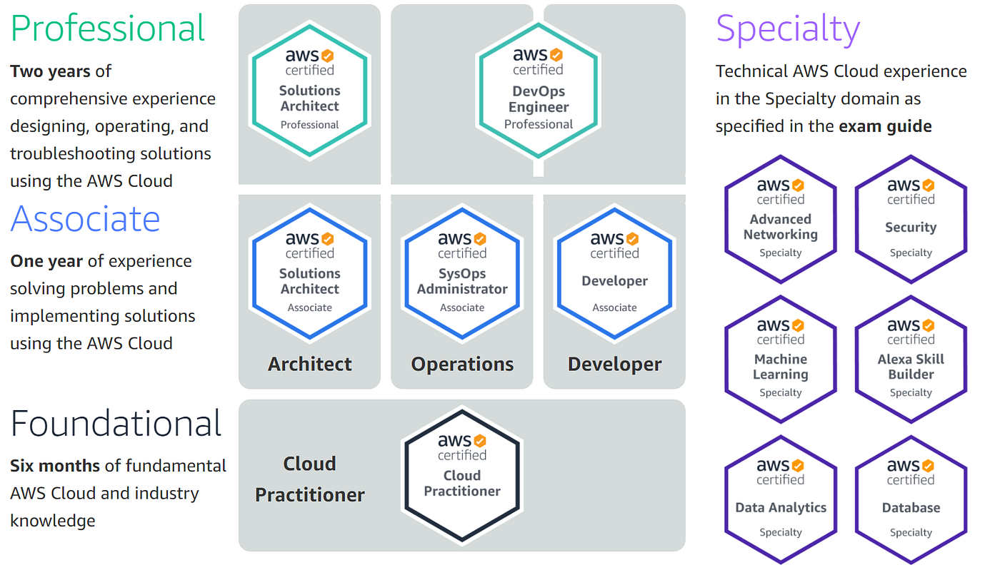

<h1><a name="readme-top"></a></h1>

[](https://github.com/marcossilvestrini/learning-aws-cloud-practitioner-essentials/actions/workflows/powershell.yml)
[](https://github.com/marcossilvestrini/learning-aws-cloud-practitioner-essentials/actions/workflows/release.yml)

[![MIT License][license-shield]][license-url]
[![Forks][forks-shield]][forks-url]
[![Stargazers][stars-shield]][stars-url]
[![Contributors][contributors-shield]][contributors-url]
[![Issues][issues-shield]][issues-url]
[![LinkedIn][linkedin-shield]][linkedin-url]

# LEARNING AWS CLOUD PRACTITIONER ESSENTIALS - CLF-C01



<p align="center">
<strong>Explore the docs »</strong></a><br />
    <a href="https://marcossilvestrini.github.io/learning-aws-cloud-practitioner-essentials/">Main Page</a>
    -
    <a href="https://github.com/marcossilvestrini/learning-aws-cloud-practitioner-essentials">Code Page</a>
    -
    <a href="https://github.com/marcossilvestrini/learning-aws-cloud-practitioner-essentials/issues">Report Bug</a>
    -
    <a href="https://github.com/marcossilvestrini/learning-aws-cloud-practitioner-essentials/issues">Request Feature</a>
</p>

## Summary

<details>
  <summary><b>TABLE OF CONTENT</b></summary>
  <ol>
    <li>
      <a href="#about-the-project">About The Project</a>
    </li>
    <li>
      <a href="#getting-started">Getting Started</a>
      <ul>
        <li><a href="#prerequisites">Prerequisites</a></li>
        <li><a href="#installation">Installation</a></li>
      </ul>
    </li>
    <li><a href="#usage">Usage</a></li>
    <li><a href="#roadmap">Roadmap</a></li>
    <li><a href="#course-objective">Course Objectives</a></li>
    <li><a href="#course-prerequisites">Course Prerequisites</a></li>
    <li><a href="#course-module-1">Module 1: Cloud Concepts</a></li>
    <li><a href="#course-module-2">Module 2: Security and Compliance</a></li>
    <li><a href="#course-module-3">Module 3: Technology</a></li>
    <li><a href="#course-module-4">Module 2: Billing and Pricing</a></li>
    <li><a href="#awscli">AWS CLI</a>
    <li><a href="#license">License</a></li>
    <li><a href="#contact">Contact</a></li>
    <li><a href="#acknowledgments">Acknowledgments</a></li>
  </ol>
</details><br>

<a name="about-the-project"></a>

## About Project

>This project aims to help students or professionals to learn the main concepts of aws-cloud-practitioner-essentials exam

<p align="right">(<a href="#readme-top">back to top</a>)</p>

<a name="getting-started"></a>

## Getting Started

This is an example of how you may give instructions on setting up your project locally.
To get a local copy up and running follow these simple example steps.

<a name="prerequisites"></a>

### Prerequisites

This is an example of how to list things you need to use the software
and how to install them.

* git
* Virtual Box and extension
* Vagrant

<a name="installation"></a>

### Installation

Clone the repo

```sh
git clone https://github.com/marcossilvestrini/learning-aws-cloud-practitioner-essentials.git
```

<a name="usage"></a>

## Usage

Use this repository for get learning about aws-cloud-practitioner-essentials exam

<p align="right">(<a href="#readme-top">back to top</a>)</p>

<a name="roadmap"></a>

## Roadmap

* [x] Create repository
* [x] Create examples about Exam
* [x] Create github action for automation tasks
* [x] Upload simulated exam

<p align="right">(<a href="#readme-top">back to top</a>)</p>

## Course objectives

<a name="course-objective"></a>

<https://explore.skillbuilder.aws/learn/course/9449/exam-prep-aws-certified-cloud-practitioner-clf-c01>

* Explain the value of the AWS Cloud
* Understand and explain the AWS shared responsibility model
* Understand security best practices
* Understand AWS Cloud costs, economics, and billing practices
* Describe and position the core AWS services, including compute, network, databases, and storage
* Identify AWS services for common use cases

<p align="right">(<a href="#course-objective">back to aws objective</a>)</p>
<p align="right">(<a href="#readme-top">back to top</a>)</p>

## Course Prerequisites

<a name="course-prerequisites"></a>

We recommend that attendees of this course have the following knowledge:

* Understanding of AWS Cloud concepts
* Understanding of security and compliance within the AWS Cloud
* Understanding of the core AWS services
* Understanding of the economics of the AWS Cloud
* Course outline
* Course Introduction

<p align="right">(<a href="#course-prerequisites">back to course prerequisites</a>)</p>
<p align="right">(<a href="#readme-top">back to top</a>)</p>

## Module 1: Cloud Concepts

<a name="course-module-1"></a>

Define the AWS Cloud and its value proposition

### Define the benefits of the AWS Cloud

* Explain how the AWS Cloud allows users to focus on business value
* Question walkthrough

### Identify aspects of AWS Cloud economics

* Define items that would be part of a Total Cost of Ownership (TCO) proposal
* Identify which operations will reduce costs by moving to the cloud
* Question walkthrough

### Explain the different cloud architecture design principles

* Explain the design principles
* Question walkthrough

<p align="right">(<a href="#course-module-1">back to module 1</a>)</p>
<p align="right">(<a href="#readme-top">back to top</a>)</p>

## Module 2: Security and Compliance

<a name="course-module-2"></a>

### Define the AWS shared responsibility model

* Recognize the elements of the shared responsibility model
* Describe the customer’s responsibility on AWS
* Describe AWS responsibilities
* Question walkthrough

### Define AWS Cloud security and compliance concepts

* Identify where to find AWS compliance information
* At a high level, describe how customers achieve compliance on AWS
* Describe who enables encryption on AWS for a given service
* Recognize there are services that will aid in auditing and reporting
* Explain the concept of least privileged access
* Question walkthrough

### Identify AWS access management capabilities

* Understand the purpose of User and Identity Management
* Question walkthrough

### Identify resources for security support

* Recognize there are different network security capabilities
* Recognize there is documentation and where to find it (for example, best practices, whitepapers, official documents)
* Know that security checks are a component of AWS Trusted Advisor
* Question walkthrough

<p align="right">(<a href="#course-module-2">back to module 2</a>)</p>
<p align="right">(<a href="#readme-top">back to top</a>)</p>

## Module 3: Technology

<a name="course-module-3"></a>

### Define methods of deploying and operating in the AWS Cloud

* At a high level, identify different ways of provisioning and operating in the AWS Cloud
* Identify different types of cloud deployment models
* Identify connectivity options
* Question walkthrough

### Define the AWS global infrastructure

* Describe the relationships among Regions, Availability Zones, and Edge Locations
* Describe how to achieve high availability through the use of multiple Availability Zones
* Describe when to consider the use of multiple AWS Regions
* Describe the benefits of Edge Locations at a high level
* Question walkthrough

### Identify the core AWS services

* Describe the categories of services on AWS (compute, storage, network, database)
* Identify AWS compute services
* Identify different AWS storage services
* Identify AWS networking services
* Identify different AWS database services
* Question walkthrough

### Identify resources for technology support

* Recognize there is documentation (best practices, whitepapers, AWS Knowledge Center, forums, blogs)
* Identify the various levels and scope of AWS Support
* Recognize there is the AWS Partner Network (APN) and the AWS Marketplace, including independent software vendors and system integrators
* Identify sources of AWS technical assistance and knowledge including professional services, solutions architects, training and certification, and the APN
* Identify the benefits of using AWS Trusted Advisor
* Question walkthrough

<p align="right">(<a href="#course-module-3">back to module 3</a>)</p>
<p align="right">(<a href="#readme-top">back to top</a>)</p>

## Module 4: Billing and Pricing

<a name="course-module-4"></a>

### Compare and contrast the various pricing models for AWS (for example, On-Demand Instances, Reserved Instances, and Spot Instance pricing)

* Identify scenarios or the best fit for On-Demand Instance pricing
* Identify scenarios or the best fit for Reserved Instance pricing
* Identify scenarios or the best fit for Spot Instance pricing
* Question walkthrough

### Recognize the various account structures in relation to AWS billing and pricing

* Recognize that consolidated billing is a feature of AWS Organizations
* Identify how multiple accounts aid in allocating costs across departments
* Question walkthrough

### Identify resources available for billing support

* Identify ways to get billing support and information
* Identify where to find pricing information on AWS services
* Recognize that alarms and alerts exist
* Identify how tags are used in cost allocation

<p align="right">(<a href="#course-module-4">back to module 1</a>)</p>
<p align="right">(<a href="#readme-top">back to top</a>)</p>

## AWS CLI

<a name="awscli"></a>

### Install

Windows

```powershell

```

Linux

```sh
cd /tmp || exit
curl "https://awscli.amazonaws.com/awscli-exe-linux-x86_64.zip" -o "awscliv2.zip"
unzip awscliv2.zip
./aws/install
rm awscliv2.zip
```

### Important Commands

```sh
foo
```

<p align="right">(<a href="#awscli">back to awscli</a>)</p>
<p align="right">(<a href="#readme-top">back to top</a>)</p>

## Contributing

Contributions are what make the open source community such an amazing place to
learn, inspire, and create. Any contributions you make are **greatly appreciated**.

If you have a suggestion that would make this better, please fork the repo and
create a pull request. You can also simply open an issue with the tag "enhancement".
Don't forget to give the project a star! Thanks again!

1. Fork the Project
2. Create your Feature Branch (`git checkout -b feature/AmazingFeature`)
3. Commit your Changes (`git commit -m 'Add some AmazingFeature'`)
4. Push to the Branch (`git push origin feature/AmazingFeature`)
5. Open a Pull Request

## License

* This project is licensed under the MIT License * see the LICENSE.md file for details

## Contact

Marcos Silvestrini - marcos.silvestrini@gmail.com \
[](https://twitter.com/mrsilvestrini)

Project Link: [https://github.com/marcossilvestrini/learning-aws-cloud-practitioner-essentials](https://github.com/marcossilvestrini/learning-aws-cloud-practitioner-essentials)

<p align="right">(<a href="#readme-top">back to top</a>)</p>

## Acknowledgments

* [AWS Training Certification](https://www.aws.training/)
* [AWS Course](https://explore.skillbuilder.aws/learn/course/8287)
* [AWS Prep Course](https://explore.skillbuilder.aws/learn/course/9449/exam-prep-aws-certified-cloud-practitioner-clf-c01)
* [AWS Console](https://aws.amazon.com/console/)
* [Simulated](https://www.itexams.com/info/AWS-Certified-Cloud-Practitioner)

<p align="right">(<a href="#readme-top">back to top</a>)</p>

<!-- MARKDOWN LINKS & IMAGES-->
<!-- https://www.markdownguide.org/basic-syntax/#reference-style-links -->
[contributors-shield]: https://img.shields.io/github/contributors/marcossilvestrini/learning-aws-cloud-practitioner-essentials.svg?style=for-the-badge
[contributors-url]: https://github.com/marcossilvestrini/learning-aws-cloud-practitioner-essentials/graphs/contributors
[forks-shield]: https://img.shields.io/github/forks/marcossilvestrini/learning-aws-cloud-practitioner-essentials.svg?style=for-the-badge
[forks-url]: https://github.com/marcossilvestrini/learning-aws-cloud-practitioner-essentials/network/members
[stars-shield]: https://img.shields.io/github/stars/marcossilvestrini/learning-aws-cloud-practitioner-essentials.svg?style=for-the-badge
[stars-url]: https://github.com/marcossilvestrini/learning-aws-cloud-practitioner-essentials/stargazers
[issues-shield]: https://img.shields.io/github/issues/marcossilvestrini/learning-aws-cloud-practitioner-essentials.svg?style=for-the-badge
[issues-url]: https://github.com/marcossilvestrini/learning-aws-cloud-practitioner-essentials/issues
[license-shield]: https://img.shields.io/github/license/marcossilvestrini/learning-aws-cloud-practitioner-essentials.svg?style=for-the-badge
[license-url]: https://github.com/marcossilvestrini/learning-aws-cloud-practitioner-essentials/blob/master/LICENSE
[linkedin-shield]: https://img.shields.io/badge/-LinkedIn-black.svg?style=for-the-badge&logo=linkedin&colorB=555
[linkedin-url]: https://linkedin.com/in/marcossilvestrini
